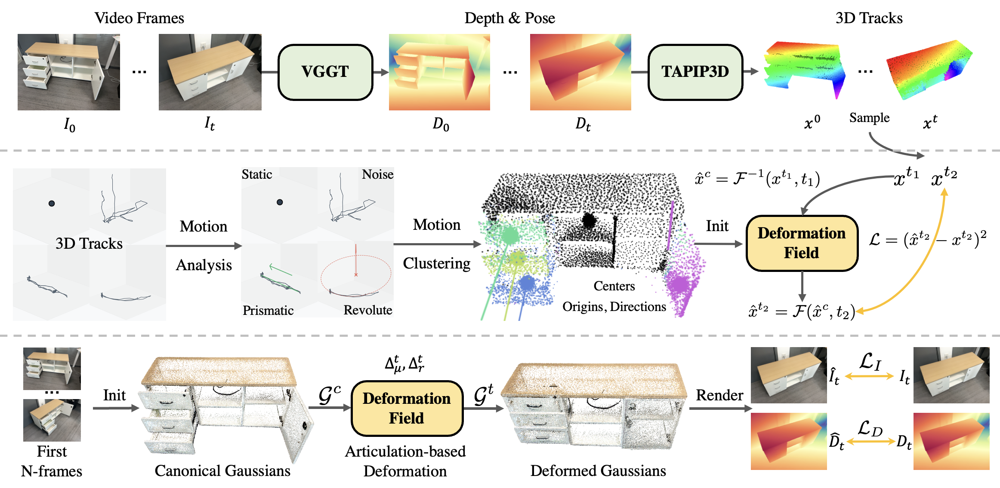

# VideoArtGS


<div align="center">

# **VideoArtGS**: Building Digital Twins of Articulated Objects from Monocular Video

<div align="center" margin-bottom="6em">
    <span class="author-block">
        <a href="https://yuliu-ly.github.io" target="_blank">Yu Liu</a><sup>1,2</sup>,</span>
    <span class="author-block">
        <a href="https://buzz-beater.github.io" target="_blank">Baoxiong Jia</a><sup>2</sup>,</span>
    <span class="author-block">
        <a href="https://github.com/Jason-aplp" target="_blank">Ruijie Lu</a><sup>2,3</sup>,</span>
    <span class="author-block">
        <a href="https://github.com/Juliagan2004" target="_blank">Chuyue Gan</a><sup>2,3</sup>,</span>
    <span class="author-block">
        <a href="https://github.com/HuayuChen2004" target="_blank">Huayu Chen</a><sup>2,3</sup>,</span>
    <br>
    <span class="author-block">
        <a href="https://dali-jack.github.io/Junfeng-Ni" target="_blank">Junfeng Ni</a><sup>1,2</sup>,</span>
    <span class="author-block">
        <a href="https://zhusongchun.net" target="_blank">Song-Chun Zhu</a><sup>1,2,3</sup>,</span>
    <span class="author-block">
        <a href="https://siyuanhuang.com" target="_blank">Siyuan Huang</a><sup>2</sup></span>
    <br>
    <span class="author-block">
        <sup>1</sup>Tsinghua University &nbsp&nbsp 
        <sup>2</sup>National Key Lab of General AI, BIGAI &nbsp&nbsp 
        <sup>3</sup>Peking University
    </span>

[Website](https://videoartgs.github.io/) | [Arxiv](https://arxiv.org/abs/2509.17647) | [Data](https://huggingface.co/datasets/YuLiu/VideoArtGS-Data)
</div>
</div>



## Environment Setup
We provide a script [install.sh](./install.sh) to install the environment.
In our experiments, we used NVIDIA CUDA 12.4 on Ubuntu 22.04. You may need to modify the installation command according to your CUDA version.

## Data Preparation
For VideoArtGS-20 Dataset, we provide data at [here](https://huggingface.co/datasets/YuLiu/VideoArtGS-Data). 

For Video2Articulation Dataset, please download the data from [Video2Articulation](https://github.com/3dlg-hcvc/video2articulation), and the Partnet-Mobility dataset, and then preprocess the data using `python data_tools/process_v2a.py`. You can also download the processed version at [here](https://huggingface.co/datasets/YuLiu/VideoArtGS-Data).

Data structure:
```
data
├── videoartgs
│   ├── realscan
│   │   ├── microwave
│   │   │   ├── images
│   │   │   ├── ...
│   ├── sapien
│   │   ├── 100481
│   │   │   ├── images
│   │   │   ├── ...
├── v2a
│   ├── sapien
│   │   ├── 100068_joint_0_bg_view_0
│   │   │   ├── images
│   │   │   ├── ...
```

## Training
We provide the following files and scripts for training:
 - ``init_cano.py`` & ``scripts/init_cano.sh`` : training the coarse single state Gaussians.
 - ``init_deform.py`` & ``scripts/init_deform.sh`` : training the deformable Gaussians.
 - ``train.py`` & ``scripts/train.sh``: training the full model.
 - ``train_gui.py`` : training the full model with GUI visualization.

Please run ``scripts/init_cano.sh`` and ``scripts/init_deform.sh`` before running ``scripts/train.sh``.

## Reloading checkpoints & Evaluation
We provide ``render.py`` and script ``scripts/render.sh, scripts/eval.sh`` for evaluation. You can download the checkpoints from [here](https://huggingface.co/datasets/YuLiu/VideoArtGS-Data) and put them in the ``outputs`` folder.

## Visualization Tools
We provide some visualization tools for intermediate results in ``vis_utils`` folder.
You can visualize the point cloud, joint, and centers for initialization in ``vis_utils/vis_init.ipynb`` and visualize the Gaussians and deformation models in ``vis_utils/vis_videoartgs.ipynb``.

## Export URDF and USD Files
We provide ``vis_utils/json2urdf.py`` to export URDF files from the trained model. Load URDF files with IsaacSim (>=4.5) to export USD files. We found that IsaacSim can not load texture of `.ply` meshes. We provide a script``vis_utils/ply2glb.py``, which uses Blender to transform the `.ply` meshes to `.glb` meshes.


## Reconstruct Articulated Objects from Self-captured Video
See detailed instructions in [preprocess.md](./data_tools/preprocess.md).


## Citation
If you find our paper and/or code helpful, please consider citing:
```
@article{liu2025videoartgs,
  title={VideoArtGS: Building Digital Twins of Articulated Objects from Monocular Video},
  author={Liu, Yu and Jia, Baoxiong and Lu, Ruijie and Gan, Chuyue and Chen, Huayu and Ni, Junfeng and Zhu, Song-Chun and Huang, Siyuan},
  journal={arXiv preprint arXiv:2509.17647},
  year={2025}
}
```

## Acknowledgement
This code heavily used resources from [ArtGS](https://github.com/YuLiu-LY/ArtGS), [SpatialTrackerV2](https://spatialtracker.github.io/), [TAPIP3D](https://github.com/zbw001/TAPIP3D), and [Video2Articulation](https://github.com/3dlg-hcvc/video2articulation). We thank the authors for open-sourcing their awesome projects.