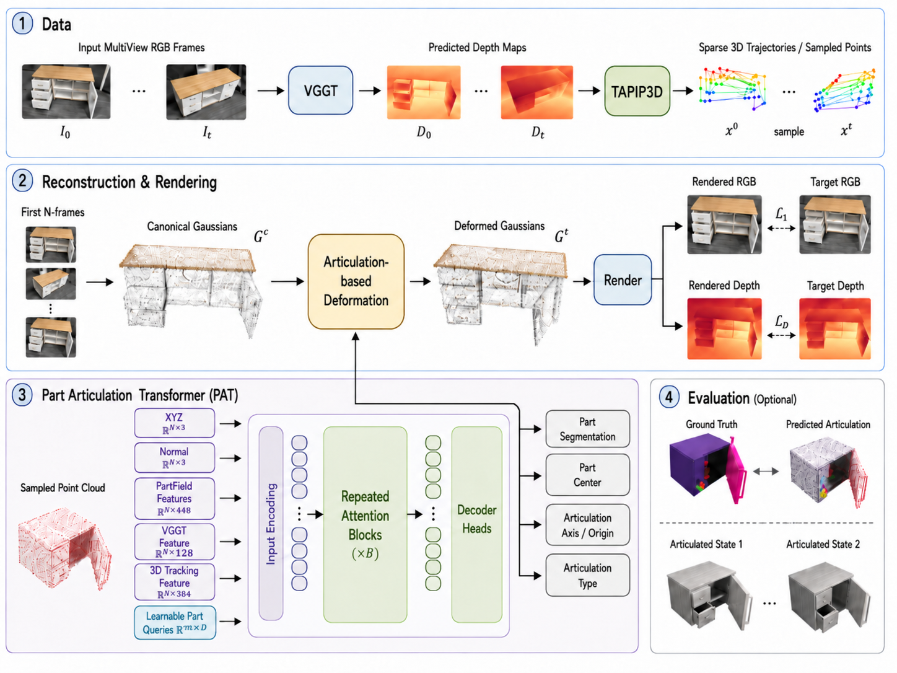

# ArtTrans: Merge Transformer Into 3D Articulated Object Reconstruction From Videos
Inherit from Part Articulation Transformer from [PARTICULATE](https://arxiv.org/pdf/2512.11798), we merge the transformer into the original VideoArtGS pipeline, and replace the hand-crafted motion analysis with a feed-forward transformer to predict the articulation axes/origins prior as **ArtTrans** pipeline.

## Architecture
Input multi-frames --> Canonical gaussians --> Art Transformer --> Deformation field --> Output rendered video frames and joint state estimation

## Advantage over original VideoArtGS
- articulation parameters (axes/origins) prior come from a feed-forward transformer instead of the hand-crafted motion analysis; transforming the original architecture from a non-learning based method into a learning-based method

## Advantage over Particulate
- replace the input 3D mesh with the multiview frames, extending the application of 3D articulated object reconstruction from videos 

# VideoArtGS pipeline
More detailed implementation and execution description can be found in [VideoArtGS pipeline](./overview/VideoArtGS_methodology.md), with flow chart available [here](https://www.figma.com/design/7dDTR57ZKdyMfOiuJXp0s8/VideoArtGS-PAT-procedure-graph?node-id=13-172&t=a1yyM5Rf8iqJX3WM-1)

## step 1
use `bash scripts/init_cano.sh 1` 

Given multiview frames, transform into canonical gaussians in the form of point cloud

### Input
- /DATASET/images/, multiview frames(250 images from different perspectives)
- /DATASET/depth/, depth maps for each frame
- /DATASET/transforms.json, camera pose and each frame's intrinsic parameters
- /DATASET/point_cloud.ply, ground truth point cloud

### Output
- 3D gaussians after 20000 iterations with number N(N=42458 for scene `168`), for each gaussian, we have
    - position $\mu \in \mathbb{R}^3$
    - rotation $\q \in \mathbb{R}^4$
    - scale $\s \in \mathbb{R}^3$
    - opacity $\alpha \in [0,1]$
    - SH feature $\f \in \mathbb{R}^{48}$ 
    - part segmentation feature $\f \in \mathbb{R}^{16}$
In total, we get $N \times 75$ parameters for each scene as gaussian primitives attributes

visualization:
[point_cloud_init](./assets/images/init_cano_pc.png)


## Step 2
### Objective
This stage trains a coordinate-based Multi-Layer Perceptron (MLP) to learn the kinematic priors and the continuous deformation field of the dynamic scene. Instead of updating the canonical Gaussian attributes, it establishes a mapping network that outputs the spatial variations—specifically, the translation offset ($\delta \mu \in \mathbb{R}^3$) and rotation offset ($\delta r \in \mathbb{R}^4$)—for each Gaussian primitive given a specific timestamp $t$.

### Key Modules
*   **Segmentation Module (`HybridSeg`)**: Computes the part-belonging probabilities (Part Masks) for each Gaussian primitive. It implicitly learns to group points into rigid kinematic parts without explicit 3D annotations.
*   **Articulation Module (`ArticulationModel`)**: Models the mechanical skeleton constraints, outputting the articulation parameters to drive the grouped primitives.

### Input
*   `DATASET/joint_infos.json`: the json file containing the joint type, axis and pivot for each part
*   `DATASET/filtered.npz`: Sparse 3D motion trajectories acting as physical tracking supervision. 
    - coords: dimension (100, 7700, 3), `100` frames, `7700` tracked points, each with 3D coordinates.
    - visibs: dimension (100, 7700), `100` frames, `7700` tracked points, value $M_{xy}$ as True/False indicating whether the point `y` is visible in the frame `x`.

### Output
- `deform.pth`: The optimized neural network weights serving as a highly compressed physical engine. including
    - segmentation model
        - center, dimension (2,3), centers of each part
        - logscale, dimension (2,3), log scale of each part
        - rot, dimension (2,4), rotation of each part
        - grid, parameter dimension 10035200, map from 3D coordinates to high dimension features
        - mlp, map from dimension to raw probabilities of each part
        - motion_grid, dimension 10035200, map from 3D coordinates to motion features
        - motion_mlp, map from motion features to motion extent
    - articulation model
        - origins, dimension (3,3), origins of each part
        - directions, dimension (3,3), directions of each part
        - qr_s, dimension (4), quaternion real part
        - qd_s, dimension (4), quaternion dual part
        - time_model, total parameter 16899, map from time to state(rotation degree/prismatic distance)

---

## Step 3
### Objective
Jointly optimize **deformation field \mathcal{F}** and **canonical 3D gaussians \mathcal{G^c}** from multiview frames and tracking trajectories.


### Input 
- `OUTPUT/point_cloud.ply`, point cloud from step 1
- `OUTPUT/deform.pth`, deformation weights from step 2
- `DATASET/filtered.npz`, sparse 3D motion trajectories acting as physical tracking supervision. 
    - coords: dimension (100, 7700, 3), `100` frames, `7700` tracked points, each with 3D coordinates.
    - visibs: dimension (100, 7700), `100` frames, `7700` tracked points, value $M_{xy}$ as True/False indicating whether the point `y` is visible in the frame `x`.

### Output
- updated `point_cloud.ply`, refined canonical gaussians after joint optimization
- updated `deform.pth`, refined deformation weights after joint optimization
- output point cloud [point cloud after training](./assets/images/pc_after_train.png)

---

## Step 4
### Objective
Render the multiview frames from the optimized canonical gaussians and deformation field

### Input
- `point_cloud.ply`: trained canonical gaussians
- `deform.pth`: trained deform field


### Output
- predicted multiview images
- predicted depth maps
- predicted `joint_info.json`: The final optimized 3D physical topology (optimized axes, origins, and part centers).
- predicted `joint_value.npy`: The predicted dynamic frame matrix of shape `[K_joints+1, N_dynamic_frames]`, containing the *rotation angles $\theta$* or *prismatic displacements $x$*.


## step 5
Quantitative evaluation of the modeled articulated object, assessing 
- geometric fidelity of the reconstructed 3D shape from **CD loss**
- precision of the articulation parameter estimation as axis/position mean error and standard deviation
- closeness between predicted joint states per dynamic frame and the ground truth


### Input
- ground truth axis direction, position and point cloud
- predicted axis direction, position and point cloud

### Output
- axis error
- position error
- chamfer distance for whole point cloud
- chamfer distance for moving part point cloud
- chamfer distance for static part point cloud


## step 6(optional)
Compute gif, mp4 and mesh for the articulated scene qualitative visualization 


# ArtTrans pipeline
More detailed implementation and reproduction description can be found in [ArtTrans pipeline](./overview/ArtTrans_methodology.md)

## step 1
### Objective
This step is consistent with the original VideoArtGS pipeline, where we initialize the canonical Gaussian representation of the scene.

After that, we get the canonical gaussians, including position, rotation, scale, opacity, SH feature and part segmentation feature. The output is stored in `point_cloud.ply`.

Specifically, the dimension for each gaussian primitive is 75, including
- position $\mu \in \mathbb{R}^3$
- rotation $\q \in \mathbb{R}^4$
- scale $\s \in \mathbb{R}^3$
- opacity $\alpha \in \mathbb{R}$
- part segmentation feature $\f \in \mathbb{R}^{16}$
- SH feature $\f \in \mathbb{R}^{48}$


## Step 2: Part Articulation Transformer (PAT) Inference
### Objective
Infer articulation parameters prior directly from the 3D point cloud, replacing motion tracking and joint infos priors.

### Input
- `DATASET/point_cloud.ply` (fused depth point cloud, world frame): xyz (3) + normals (3)
- PartField features computed on the fly: 448 per point
- optional extra inputs (read from the checkpoint sidecar `<ckpt>.json`, override with `--extra_feats`):
  `track_geo` (56, from `filtered.npz`), `track_tapip` (384, `pat_extra/tapip3d_feats.npz`), `vggt` (128, `pat_extra/vggt128.npy`)
- `DATASET/joint_infos.json`: slot count, joint types and part centers (PAT overrides direction/origin of the matched slots)

### Output
- deform.pth, with exactly the same structure as the original VideoArtGS pipeline, including segmentation model and articulation model.


## Step 3-6
It stays consistent with the original pipeline.


# PAT Architecture 
Model: PAT_B (6 blocks, hidden 768, 12 heads, 151M params; `particulate/model_ckpt/pat_model.pt`).

Input per point (all in the [-0.5, 0.5]^3 normalized frame):
- xyz (3) -> Fourier positional embedder (64 freqs + raw = 195) -> 768
- normals (3) -> same embedder -> 768
- PartField features (448) -> `feat_proj` Linear(448 -> 768)
- raw input = 454 dims, token dim 768; 16 part-query tokens on the query side
- optional extra modalities (VideoArtGS extension, `extra_feat_dims` / `extra_embeds` in `particulate/models.py`,
  each LayerNorm + MLP -> 768, zero-initialised so the released weights are reproduced exactly):

| modality | dim | source | how to produce |
|---|---|---|---|
| `track_geo` | 56 | TAPIP3D trajectories in `filtered.npz`: displacement at 8 time stamps + visibility, motion statistics, fitted axis, motion-type one-hot, kNN confidence/valid | computed on the fly (`PAT/pat_extra_feats.py`) |
| `track_tapip` | 384 | TAPIP3D EfficientUpdateFormer hidden state per track (last iteration, averaged over windows/frames), kNN-transferred to points | `python data_tools/extract_tapip3d_feats.py --data_dir ./data/videoartgs/sapien` (videoartgs env) |
| `vggt` | 128 | VGGT (SpatialTrackerV2 front-end VGGT4Track) last aggregator layer, 2048-d frame‖global tokens, multi-view averaged onto points, PCA 2048 -> 128 | `python data_tools/extract_vggt_feats.py --data_dir ./data/videoartgs/sapien` (st2 env) |

With all three the raw per-point input is 454 + 568 = 1022 dims; the transformer is unchanged.

Fine-tuning with the extra inputs (LoRA on attention + the new branches), then inference:
```bash
python PAT/PAT_finetune.py --epochs 120 --extra_feats track_geo,track_tapip,vggt --labels track --train_on_all --save_name trained_PAT_model.pt
bash scripts/videoartgs_pat_pipeline.sh --use_multi 1 --keep_logs 1 --mode 1 --output_dir outputs_PAT_3 --save_dir PAT_3 --PAT_model_pth particulate/model_ckpt/trained_PAT_model.pt
# or everything in one go (waits for the feature files first):
ALLOWED_GPUS=4,5,6 bash scripts/videoartgs_pat3_chain.sh
```

Output, articulation parameters including
- part_ids
- motion_hierarchy
- is_part_revolute
- is_part_prismatic
- revolute_plucker
- revolute_range
- prismatic_axis
- prismatic_range
- closest_point_on_axis


# Loss Analysis
- canonical-to-observation loss: $L_{c2o}$
- render loss


# Evaluation Analysis
In dataset `VideoArtGS`, 
we already have ground truth,
- axis direction $A_{gt} \in \mathbb{R}^3$
- axis position $P_{gt} \in \mathbb{R}^3$
- point cloud, stored in .ply 
    - $P_{whole_gt} \in \mathbb{R}^{N \times 3}$
    - $P_{part_x_gt} \in \mathbb{R}^{M_x \times 3}$
x=1,2,...,k, where k is the number of parts in the scene
we want to compute
- axis direction $A_{pred} \in \mathbb{R}^3$
- axis position $P_{pred} \in \mathbb{R}^3$
- point cloud, stored in .ply 
    - $P_{whole_pred} \in \mathbb{R}^{N \times 3}$
    - $P_{part_x_pred} \in \mathbb{R}^{M_x \times 3}$
x=1,2,...,k, where k is the number of parts in the scene

And then evaluate by 
- axis error $E_A = \arccos(\frac{A_{gt} \cdot A_{pred}}{||A_{gt}|| ||A_{pred}||})$
- position error $E_P = ||P_{gt} - P_{pred}||_2$
- chamfer distance $CD(P_{whole_gt}, P_{whole_pred})$ and
- chamfer distance $CD(P_{part_x_gt}, P_{part_x_pred})$

# Complementary notes
time cost for each step:
- step 1: initialize canonical gaussians, 4 minutes per scene, 20000 iterations, A100-40GB-PCle
- step 2: 12 seconds per scene for PAT integration, A100-40GB-PCle
- step 3: train, 15 minutes per scene, 20000 iterations, A100-40GB-PCle
- step 4: render, 3 minutes per scene, 250 frames, A100-40GB-PCle

# Work record:
- paper draft: https://www.overleaf.com/read/ycpyfxkvqvbf#afcf35
- google slide: https://docs.google.com/presentation/d/1YcpoI45y0KWuTI1eML8tbts4UegyBW2T5pQ-FR4elko/edit?usp=sharing
- pipeline flow chart: https://www.figma.com/design/7dDTR57ZKdyMfOiuJXp0s8/ArtTrans-pipeline-graph?node-id=0-1&t=08qbCRizHWf0gGO3-1