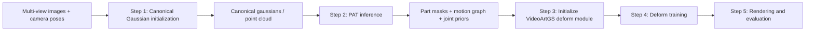

# VideoArtGS + PAT pipeline

This note describes how to integrate Part Articulation Transformer (PAT) from Particulate into the VideoArtGS deformation pipeline.

The key idea is:
- VideoArtGS still handles the dynamic Gaussian scene representation and frame-wise deformation.
- PAT is used as a structural prior estimator for articulated objects.
- PAT does not replace rendering or Gaussian optimization; it replaces the weak or hand-crafted articulation prior with a learned part-and-joint prior.

## High-level view



PAT sits between canonical scene initialization and deformation training. It provides the structure that VideoArtGS needs in order to know which primitives move together and what joint each part should follow.

## What PAT actually does

PAT is a feed-forward articulation parser for a static 3D object.

Given a point cloud or mesh of one object, it predicts:
- part segmentation
- part hierarchy / adjacency
- motion type for each part
- revolute axis and pivot representation
- prismatic axis
- motion range or limit

In other words, PAT turns raw geometry into a kinematic description.

It does **not**:
- render images
- optimize Gaussian appearance
- learn a per-frame deformation field directly
- replace the temporal deformation module in VideoArtGS

## PAT architecture

The architecture in Particulate can be understood as four stages.

### 1. Geometry feature encoding

Input to PAT is a normalized point cloud with per-point features.

Typical inputs are:
- point coordinates `xyz`
- normals `normals`
- PartField features `feats`

The encoder fuses:
- positional embeddings of point coordinates
- optional normal embeddings
- projected point features

This stage builds point-level representations that carry both local geometry and semantic cues.

### 2. Point-to-part attention blocks

PAT uses attention blocks that exchange information between point tokens and part-query tokens.

The point tokens represent geometry.
The query tokens represent part slots or part identities.

This lets the model jointly reason about:
- which points belong to which part
- how parts interact with each other
- whether a part is static, revolute, or prismatic

### 3. Task-specific decoders

From the shared latent representations, PAT decodes several predictions:
- point masks for part assignment
- part hierarchy / adjacency matrix
- motion class logits
- revolute motion parameters
- prismatic motion parameters
- optional per-point closest-axis representation

### 4. Post-processing

The raw predictions are converted into a consistent articulated structure:
- part IDs are assigned
- invalid or low-confidence parts can be merged or removed
- motion hierarchy is extracted from adjacency scores
- motion parameters are normalized into usable joint representations

So PAT is not just a classifier. It is a structural parser that outputs a full articulated description of the object.

## End-to-end pipeline for VideoArtGS + PAT

### Step 1: Canonical Gaussian initialization

This step is the same as the original VideoArtGS pipeline.

#### Input
- multi-view RGB frames
- camera extrinsics and intrinsics
- optional ground-truth or reconstructed point cloud, depending on the dataset setup

#### Output
- canonical 3D Gaussian representation
- canonical point cloud / `point_cloud.ply`
- per-Gaussian attributes such as:
	- position
	- rotation
	- scale
	- opacity
	- SH features
	- part segmentation features

#### Role in the pipeline

This step builds the static canonical scene representation that PAT and the deformation module both consume.

PAT should be run on this canonical geometry, not on already deformed frames.

### Step 2: PAT inference on canonical geometry

This is the new structural prior stage.

#### Input
- canonical point cloud with features in dimension 75
- optionally PartField features, 

In practice, the cleanest input is the canonical point cloud extracted from Step 1.

#### Output
- per-point part IDs or part masks
- part adjacency or hierarchy
- motion class per part
- revolute joint axis or Plucker-like representation
- revolute pivot / origin
- prismatic axis
- motion range

#### Role in the pipeline

PAT provides the kinematic prior that tells VideoArtGS:
- how many parts the object has
- which primitives belong to each part
- what type of motion each part follows
- where the joint axis and origin should start

This is the core replacement for a weak or manually initialized articulation prior.

### Step 3: Convert PAT outputs into VideoArtGS initialization

This step is the bridge between the two systems.

#### Input
- PAT part masks
- PAT joint types
- PAT axis / origin / range predictions
- canonical Gaussian positions from VideoArtGS

#### Output
- initialized segmentation module parameters
- initialized articulation module parameters
- an initialized `deform.pth` or equivalent deform state

#### What this means conceptually

VideoArtGS expects a decomposition into:
- part grouping / segmentation
- joint origin and direction
- time-dependent articulation parameters

PAT can populate the first two, and partially initialize the third.

If the object is revolute, PAT gives an axis and a pivot.
If the object is prismatic, PAT gives a translation axis.
If the object has multiple moving parts, PAT gives the hierarchy that tells the deform module which joint is parent and which is child.

### Step 4: Deformation training in VideoArtGS

This is the original VideoArtGS training stage, now informed by PAT.

#### Input
- canonical gaussians
- initialized deform module from PAT priors
- multi-view images
- camera parameters
- training-time supervision used by VideoArtGS

Depending on your exact setup, this may include:
- photometric supervision
- track supervision
- regularization losses
- density control / pruning / splitting

#### Output
- optimized `deform.pth`
- refined canonical gaussians
- learned time-dependent deformation behavior

#### Role in the pipeline

PAT does not remove the need for this stage.
What it does is reduce ambiguity in the deformation initialization, so the deform module starts from a more physically meaningful articulation structure.

### Step 5: Rendering and evaluation

This is the final inference stage.

#### Input
- trained Gaussian scene
- trained deform module
- camera path or evaluation viewpoints

#### Output
- rendered RGB frames
- depth maps if enabled
- part visualizations or pseudo-colored masks if enabled
- evaluation metrics

#### Role in the pipeline

This stage validates whether the PAT-initialized deformation module still produces good visual quality and whether the predicted articulation is physically plausible.

## What PAT changes in the original VideoArtGS logic

Without PAT, the deform stage needs to discover part structure and joint structure largely from the training signal and current initialization.

With PAT, the deform stage gets an explicit articulated prior:
- better part grouping
- more stable joint initialization
- less reliance on weak geometric heuristics
- more interpretable motion decomposition

So the expected gain is not only better convergence, but also a cleaner articulation representation.

## Suggested implementation directory

The following is a reasonable directory layout for integrating PAT into VideoArtGS without mixing concerns.

```text
VideoArtGS/
	overview/
		VideoArtGS+PAT_pipeline.md
	pat/
		__init__.py
		pat_infer.py
		pat_preprocess.py
		pat_postprocess.py
		pat_io.py
		pat_to_videoartgs.py
		configs/
			pat_default.yaml
	scene/
		deform_model.py
		videoartgs.py
		module.py
	scripts/
		init_cano.sh
		init_deform.sh
		train.sh
		render.sh
```

### Directory responsibilities

- `pat/pat_preprocess.py`
	- load canonical point clouds
	- compute or attach normals or features
	- normalize geometry into PAT input space

- `pat/pat_infer.py`
	- run PAT forward inference
	- produce raw part and joint predictions

- `pat/pat_postprocess.py`
	- convert raw PAT predictions into stable part IDs and joint priors
	- filter low-confidence parts
	- normalize axes and pivots

- `pat/pat_io.py`
	- save and load PAT predictions
	- define a simple intermediate format such as JSON or NPZ

- `pat/pat_to_videoartgs.py`
	- map PAT outputs to the fields expected by VideoArtGS
	- build `joint_infos`-style structures
	- initialize segmentation and articulation modules

## Recommended intermediate data format

To keep the integration clean, PAT should export a lightweight intermediate file before entering VideoArtGS.

Suggested fields:
- `part_ids`
- `part_masks`
- `motion_hierarchy`
- `joint_types`
- `origin`
- `direction`
- `axis`
- `range`
- `confidence`

This makes it easier to debug each stage separately.

## Practical interpretation of the integration

If the goal is to “replace the original deformation field,” the precise meaning should be handled carefully.

The realistic version is:
- PAT replaces the initialization of articulation structure
- VideoArtGS keeps the actual time-dependent deformation model

The risky version would be:
- trying to use PAT alone as the deformation network

That is usually not what the architecture is designed for.

So the right integration point is the deform initialization and joint prior, not the render-time deformation engine itself.

## Minimal summary

PAT input:
- canonical static geometry

PAT output:
- part segmentation
- hierarchy
- joint type
- axis / origin / range

VideoArtGS input after PAT:
- the same canonical gaussians
- PAT-derived articulation priors

VideoArtGS output:
- time-dependent deformation of gaussians
- rendered articulated frames
- trained `deform.pth`

In short, PAT answers “what is the object’s articulation structure,” while VideoArtGS answers “how do these canonical gaussians move through time under that structure.”
